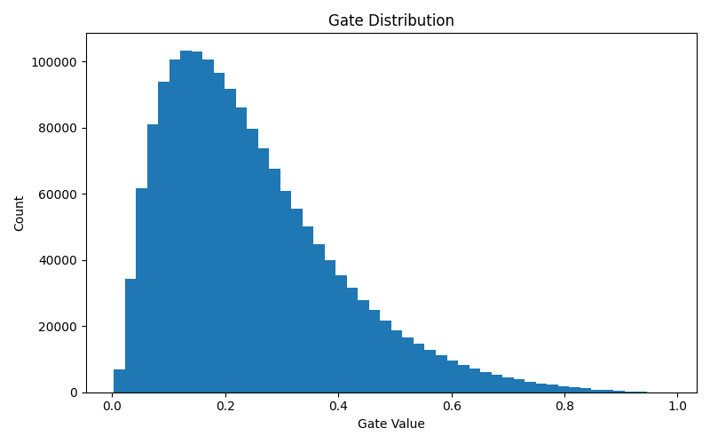

# Self-Pruning Neural Network
This project implements a self-pruning neural network where connections are dynamically removed during training using learnable gates and sparsity regularization.

## Problem
Build a model that classifies CIFAR-10 images and removes weak connections during training.

## Method
Each weight has a sigmoid gate. A sparsity loss pushes weak connections to zero.

## Model
3072 → 512 → 256 → 10

## Training
Trained with 3 lambda values.

## Results
| Lambda | Accuracy | Sparsity |
|--------|---------|----------|
| 1e-5   | 42.17%  | 10.38%   |
| 1e-4   | 43.38%  | 15.56%   |
| 1e-3   | 39.73%  | 16.57%   |

## Observation
As lambda increases, sparsity increases, meaning more connections are pruned.
However, higher sparsity slightly reduces accuracy.
This shows a clear trade-off between model performance and model size.

## Why L1 on Gates Encourages Sparsity
The L1 penalty pushes gate values toward zero.
Since each gate controls whether a weight is active, pushing gates to zero effectively removes connections.
This leads to a sparse network where only important connections remain.

## Gate Distribution
The histogram of gate values shows many values close to zero and some larger values,
indicating that the model successfully pruned weaker connections while keeping important ones.

## Conclusion
Model successfully prunes unnecessary connections.

